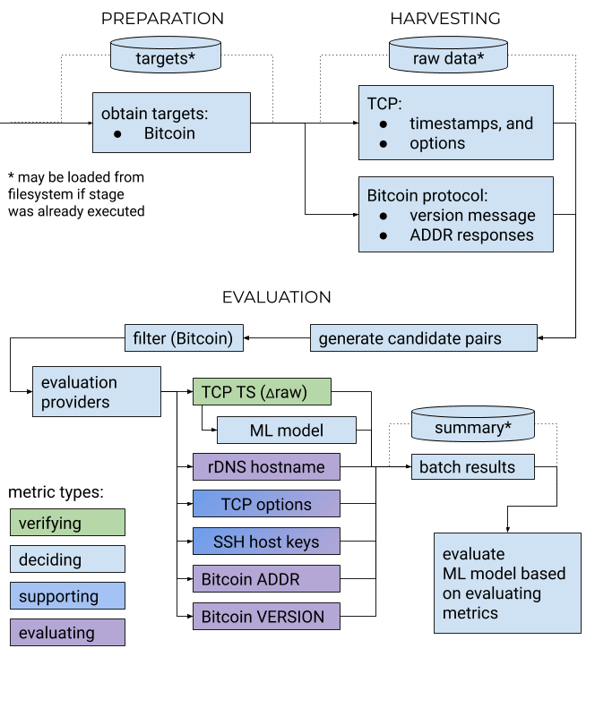

# IP Sibling Detection on Bitcoin Nodes

*IP Sibling Detection Toolset*

A Python framework designed to measure clock skew and Bitcoin-specific properties over all nodes of the Bitcoin network.
The list of nodes is acquired using the Bitnodes.io API. Details about the high-level process may be found in the thesis
that produced this framework, which is provided in `thesis-pnowak-github.pdf`.

## Usage Message

```
usage: ipsiblings [-h] [-d BASE_DIR] [--run-id RUN_ID] [--export-plots] [--evaluator {TCPRAW_SCHEITLE,TCPRAW_STARKE,DOMAIN,SSH_KEYSCAN,TCP_OPTIONS,ML_STARKE,BITCOIN,BITCOIN_ADDR,BITCOIN_ADDR_SVC}]
                  [--skip-evaluator {TCPRAW_SCHEITLE,TCPRAW_STARKE,DOMAIN,SSH_KEYSCAN,TCP_OPTIONS,ML_STARKE,BITCOIN,BITCOIN_ADDR,BITCOIN_ADDR_SVC}] [--eval-batch-size EVAL_BATCH_SIZE]
                  [--eval-fail-fast] [--eval-ssh-timeout EVAL_SSH_TIMEOUT] [--eval-first-batch EVAL_FIRST_BATCH] [--eval-batch-count EVAL_BATCH_COUNT] [--eval-discard-results]
                  [--eval-totals-in-memory] [--eval-recalc-stats] [--skip-eval] [--only-init] [-v | -q] [--targets-from {BITCOIN,FILESYSTEM}] [--skip-v SKIP_V] [--from START_INDEX] [--to END_INDEX]
                  [--do-harvest] [--really-harvest] [--harvester {TCP_TS,BTC}] [-hd HARVEST_DURATION] [-ti TS_INTERVAL] [-bi BTC_INTERVAL] [-htf HARVEST_TIMEOUT_FINAL] [--skip-os]
                  [--skip-os-sysctls] [--skip-os-iptables] [--skip-os-ntp]

IP Siblings Toolset

optional arguments:
  -h, --help            show this help message and exit

PATHS:
  -d BASE_DIR, --base-dir BASE_DIR
                        Base directory for application data (default ./target)
  --run-id RUN_ID       Identifier for the run to contribute to, appended to the base directory. (default current date-time)

EVALUATION:
  --export-plots        Export plots after evaluation
  --evaluator {TCPRAW_SCHEITLE,TCPRAW_STARKE,DOMAIN,SSH_KEYSCAN,TCP_OPTIONS,ML_STARKE,BITCOIN,BITCOIN_ADDR,BITCOIN_ADDR_SVC}
                        Select a specific evaluator instead of running all of them. May be specified multiple times.
  --skip-evaluator {TCPRAW_SCHEITLE,TCPRAW_STARKE,DOMAIN,SSH_KEYSCAN,TCP_OPTIONS,ML_STARKE,BITCOIN,BITCOIN_ADDR,BITCOIN_ADDR_SVC}
                        Skip a specific evaluator. May be specified multiple times.
  --eval-batch-size EVAL_BATCH_SIZE
                        Candidates to evaluate per batch (default 10_000)
  --eval-fail-fast      Exit immediately upon the first evaluation exception.
  --eval-ssh-timeout EVAL_SSH_TIMEOUT
                        Timeout in seconds per batch for SSH keyscan, default 60.
  --eval-first-batch EVAL_FIRST_BATCH
                        Start counting eval batches at this number, default 0.
  --eval-batch-count EVAL_BATCH_COUNT
                        How many batches to evaluate, default all.
  --eval-discard-results
                        Discard evaluation results (to only invoke side effects, e.g. keyscan)
  --eval-totals-in-memory
                        Compute total stats in memory
  --eval-recalc-stats   Recompute stats for each batch from candidates.tsv, no evaluation

SKIP STEPS:
  --skip-eval           Skip any interpretation of collected data
  --only-init           Exit after loading configuration

LOGGING:
  -v, --verbose         Increase verbosity once per call
  -q, --quiet           Decrease verbosity once per call

TARGET NODES:
  --targets-from {BITCOIN,FILESYSTEM}
                        Where to get target nodes from (default TargetProviderChoice.BITCOIN)
  --skip-v SKIP_V       Skip IPvX addresses while acquiring targets (for testing, may be specified multiple times, ignored for filesystem provider)
  --from START_INDEX    Index of first target to consider (default 0)
  --to END_INDEX        Index of first target to skip (default none)

TIMESTAMP COLLECTION:
  --do-harvest          Collect (harvest) if no timestamps present
  --really-harvest      Harvest even if we already have timestamps
  --harvester {TCP_TS,BTC}
                        Select a specific harvester instead of running all of them. May be specified multiple times.
  -hd HARVEST_DURATION, --harvest-duration HARVEST_DURATION
                        Collection duration, seconds (default 36000)
  -ti TS_INTERVAL, --ts-interval TS_INTERVAL
                        Collection interval for timestamps per target, seconds (default 60)
  -bi BTC_INTERVAL, --btc-interval BTC_INTERVAL
                        Collection interval for Bitcoin protocol per target, seconds (default 1800 / 30min)
  -htf HARVEST_TIMEOUT_FINAL, --harvest-timeout-final HARVEST_TIMEOUT_FINAL
                        Wait at least this long for replies after the last iteration (default 120)

OPERATING SYSTEM SETTINGS:
  By default, we adapt some global (!!) OS settings. The previous values are saved to ./settings.bak and restored when the application exits.

  --skip-os             Skip all OS settings
  --skip-os-sysctls     Skip overwriting necessary sysctls
  --skip-os-iptables    Skip adding necessary iptables rules
  --skip-os-ntp         Skip disabling NTP client

```

## Architecture


Allowed outgoing dependencies:
 * any → model, config, logsetup, libconstants (legacy)
 * bootstrap, scripts → any
 * evaluation → harvesting → preparation

## Execution

For measurement, you need a dual-stack server with sufficient bandwidth and at least 1 GB of RAM. It is advised to
enable at least 2 GB of swap (file-based is fine)
to handle spikes due to other applications -- you don't want a ten-hour run to be OOM-killed at the ninth hour. If swap
is not desired, an appropriately higher amount of RAM is necessary.

For evaluation, more resources are necessary. It is technically possible to evaluate on a low-end host such as the one
suggested for measurement above, but you need to specify a very low batch size (10k or less) and it will take a long
time, producing many batches that need to be merged. Note that, at the time of writing, the Bitcoin network consists of
around 6k v4 nodes and 1.5k v6 nodes, which results in around 6 million candidates for evaluation. For this work, a
Linux server with 16 GB of RAM was used. Note that evaluation is single-threaded and performance may be improved by
having multiple processes responsible for different batch numbers. Statistics collection for this execution mode may be
performed in a later run over all batches with the `--eval-recalc-stats` flag.


## File Formats
Data is stored in tab-separated values (TSV) files. The reason for this
is that we have nested lists which we want to separate using a reasonable
separator. The separator hierarchy is TAB, `,`, `:`.

Target information for the `filesystem` target provider is stored using
tuples of the following format:

| Field                  | Example                                  | Description                                                                                                                                                                                                                            |   |   |
|------------------------|------------------------------------------|----------------------------------------------------------------------------------------------------------------------------------------------------------------------------------------------------------------------------------------|---|---|
| * IP Version           | 4                                        | IP Version of the address                                                                                                                                                                                                              |   |   |
| * IP Address           | 127.0.0.1                                | Target IP address                                                                                                                                                                                                                      |   |   |
| * Port                 | 8333                                     | Target TCP port                                                                                                                                                                                                                        |   |   |
| Target Domains         | bitcoin.example.com,bitcoin2.example.com | Domains known to be associated with this target, comma-separated.                                                                                                                                                                      |   |   |
| TCP Options            | Timestamp:1234:0,MSS:1024                | TCP Options captured with the first harvested timestamp, comma-separated. The constant string `--None--` if absent. Multiple values for the same option are separated by colons, and the first field is always the name of the option. |   |   |
| ...TSval               | 1234                                     | First captured TCP timestamp value for this target, integer as returned by the TCP stack. The granularity of this varies and is not defined by the standard.                                                                           |   |   |
| ...Reception Timestamp | 34132453.567                             | Reception timestamp populated by our TCP stack, in seconds since the Unix epoch, with fractional values.                                                                                                                               |   |   |
| ...                    |                                          | The last two fields (marked with `...`) are repeated for every received timestamp.  

Individual candidate evaluation results (`candidates.tsv`)
are stored with column names corresponding to the
`export` method of `SiblingProperty` (for all properties that were requested
during evaluation).

The remaining file structures are implementation details and subject to change.

## Execution
via pip/setuptools:

```bash
python3 -m pip install -e .
```

## Distribution
As per https://packaging.python.org/tutorials/packaging-projects/.

Increment the version number in `setup.py`.
Then run `./local_install.sh`.

You can deploy this to a Linux server using the `remote_install.sh` script.
Note that you need to have `python3 python3-venv cmake` installed
on the remote server if it is running Debian.

Further, for Python-Bitcoinlib, we need the `libssl-dev` package.

## Why we need root access
It is desirable for the measuring platform not to run as root user.

For raw socket access, we could use `CAP_NET_RAW`, passed to the
Python process via ambient capabilities, as described
[here](https://stackoverflow.com/a/47982075/1117552).
We could provide a C/Rust/CPython binary wrapper that does
this, since we do not want the general Python executable
(even of a venv) to have that capability, which allows to
read and write ALL network traffic of the system.

**However,** we cannot modify sysctl values if we are not root,
which means we'd need to move that logic into the wrapper as
well, and also have the wrapper setuid to root, which
is an improvement but still not the best. Further, the OS settings logic is complex enough that we wouldn't want it to
be written in C if avoidable.

Hence, for the time being, we still require to be run as root.

## TODOs

* Reduce disk space and access times by working with a database instead of text files
* Set this up to be distributed with multiple measurement hosts
* More sophisticated Bitcoin application-layer check
* More ideas in the Future Work section of the thesis

## License

The original base of this work, https://github.com/tumi8/siblings, is licensed under GPLv2. The immediate base, created
by Marco Starke as a result of his
[Master's thesis](https://diglib.tugraz.at/identifying-ip-siblings-on-public-network-devices-2019), does not include a
license file but notes GPLv3 in the `ipsiblings/__init__.py` file. This base does not seem to be available publicly, but
can be located in the shared Git history at the `starke` tag. Due to being based on a GPLv2 work, a compatible license
is required, which GPLv3 is.
